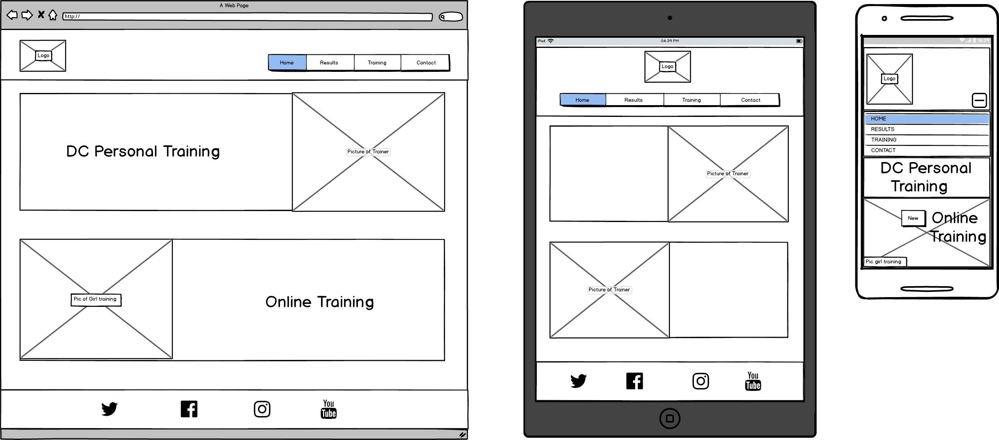
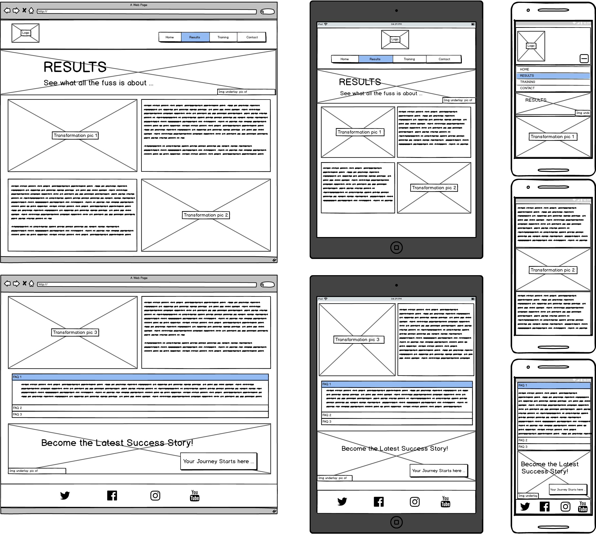
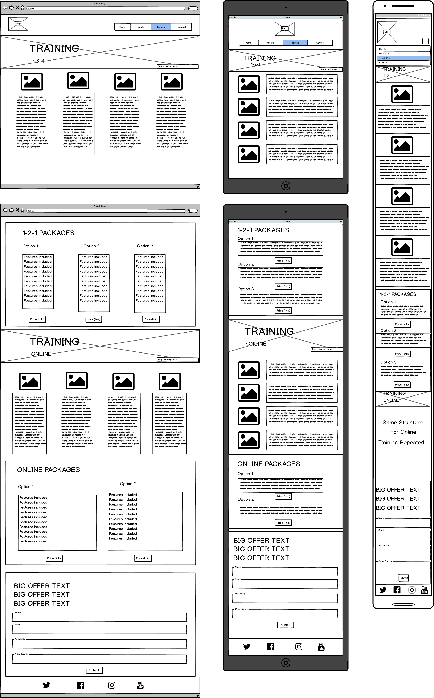
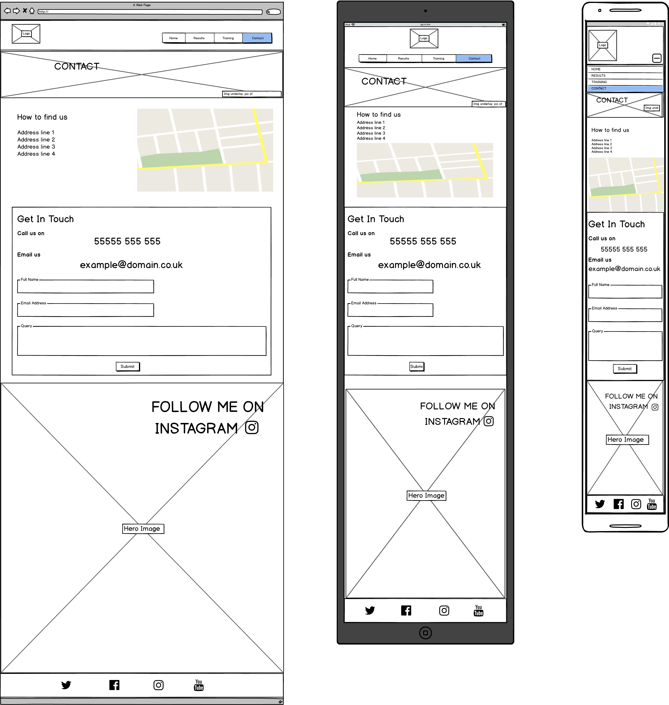

logo 
# Personal Training Webpage

A front end of a personal training service web page using HTML &amp; CSS.

## Contents

## User Experience

This project is merely intended to showcase my skills as a UI designer. My ability to appropriately style a web page whilst making it easy to navigate and fit for purpose. I thought it would be a good idea to build a web page for a personal training service. This would be a B2C website

## Wireframes

### Index page:

### Results page:

### Training page:

### Contact page:

## Testing
    Description, Expected outcome, Result: pass/fail.
### Functionality

    -links
        -outgoing
        -internal
        -anchor 
    -test forms
        -scripting (empty mandatory fields caught)
        -defaults are populated
        -Optimal formatting
    -html + css (W3C tools)
        -syntax errors
        -appropriate color schemas/contrast.
        -comply with W3C site.

### Usability

    -menus,buttons, links all clearly visible and consistent?
    -All images contain alt text.
    (test via Chalkmark, Clicktale, Clixpy or Feedback Army)

### Compatibility
    -Across different OS, browsers + resolutions.
    - use NetMechanic

## Code to Website
    Set up to github pages link.

## Contributors

I, Dominic Chaple am the sole contributor of this project.

## Resources

## Credits

libraries used.

## License

https://choosealicense.com/
https://ufal.github.io/public-license-selector/