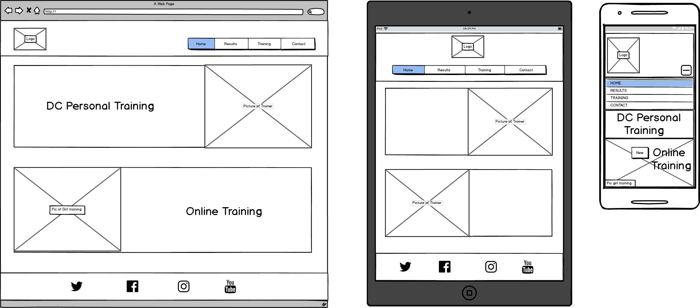
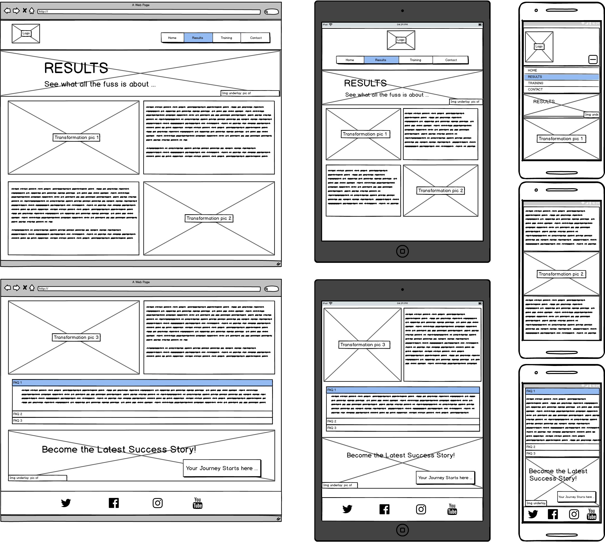
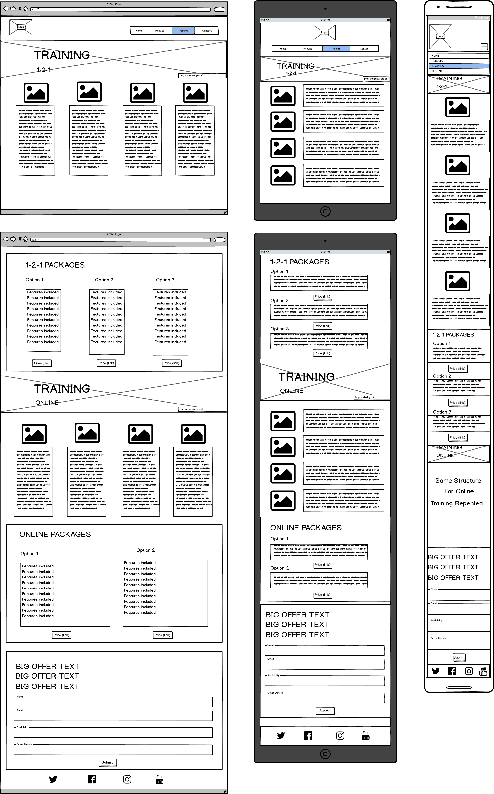
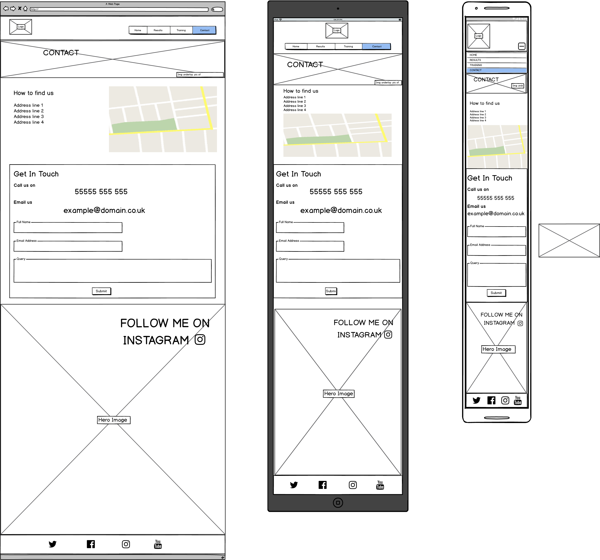

# Personal Training Webpage

A front end of a personal training service web page using HTML &amp; CSS.

Contents

Usage
This project was merely intended to showcase my skills as a UI designer. My ability to style a web page using CSS

## Wireframes

### Index page:

### Results page:

### Training page:

### Contact page:

git
## Installation

## Contributors

I, Dominic Chaple am the sole contributor of this project.

## Guides and Resources

## API

libraries used 

## License

https://choosealicense.com/
https://ufal.github.io/public-license-selector/